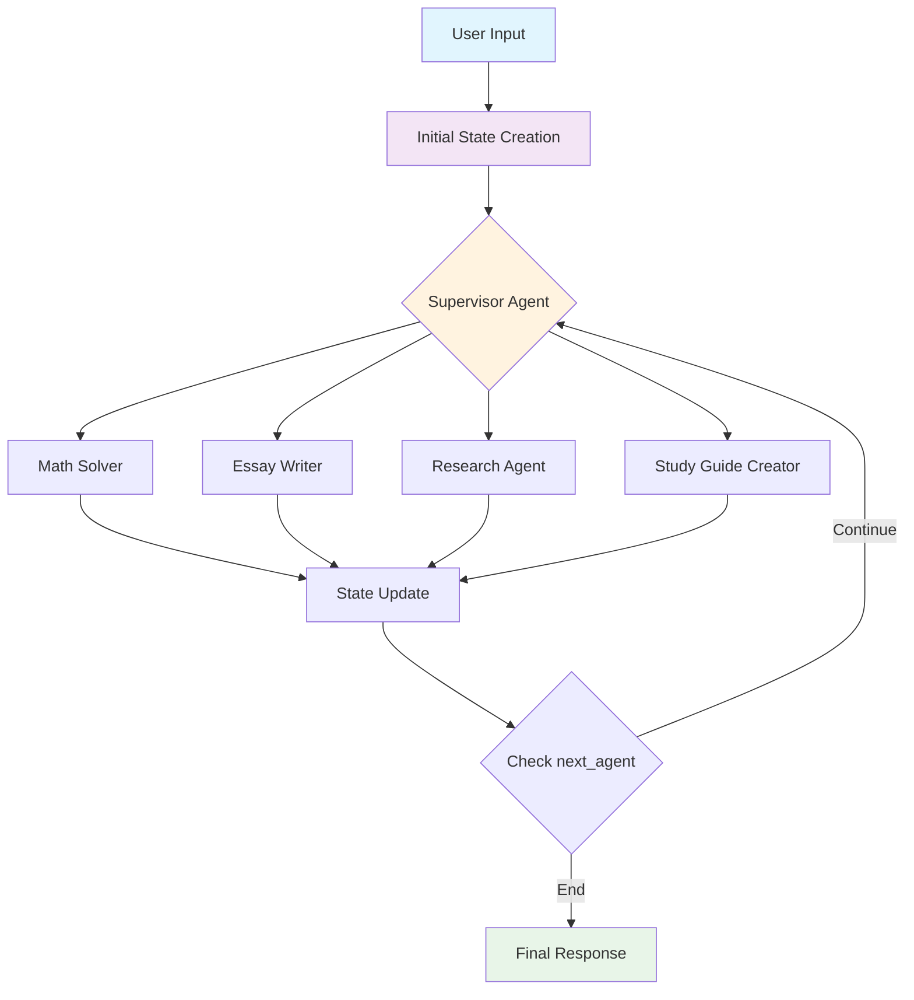
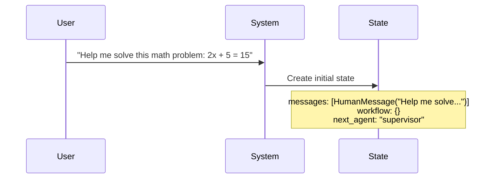
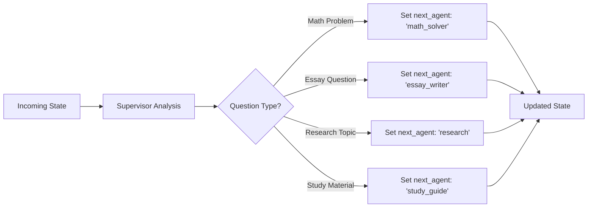
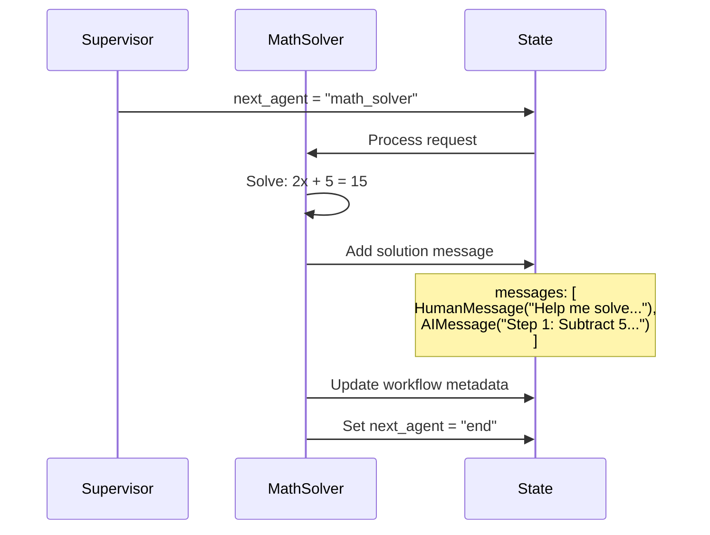
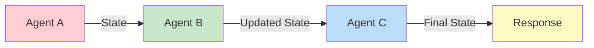
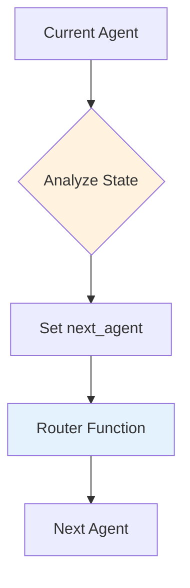
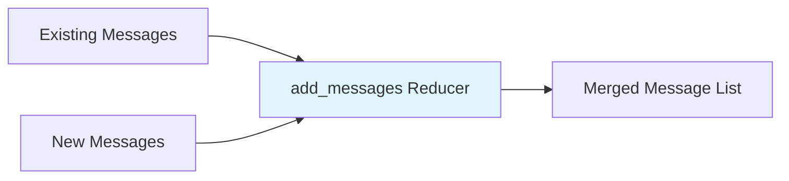
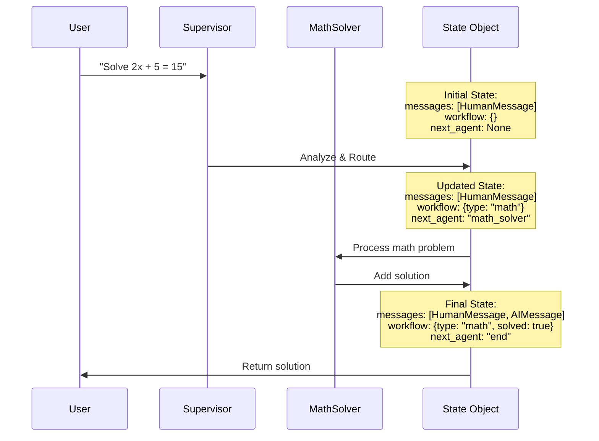

# LangGraph State Management Guide

## Overview

This document explains how the State object works in LangGraph multi-agent systems, using our Student Homework Helper as a practical example. The State object is the backbone of LangGraph workflows, enabling seamless data flow and coordination between multiple AI agents.

## What is the State Object?

The State object in LangGraph is a **shared data structure** that flows through every node (agent) in your workflow. Think of it as a "conversation context" that gets passed from agent to agent, allowing them to:

- Share information and build upon each other's work
- Maintain conversation history
- Track workflow progress
- Make routing decisions

## State Structure in Our Example

```python
class HomeworkState(TypedDict):
    """State that flows through the homework helper pipeline"""
    messages: Annotated[list[BaseMessage], add_messages]
    workflow: dict  # MongoDB-like workflow document  
    next_agent: Literal["math_solver", "essay_writer", "research", "study_guide", "end"]
```

### State Components Explained

| Component | Type | Purpose |
|-----------|------|---------|
| `messages` | `list[BaseMessage]` | Conversation history between user and agents |
| `workflow` | `dict` | Metadata about the current homework task and progress |
| `next_agent` | `Literal` | Routing decision for which agent should handle the request next |

## Visual Flow Diagram



## State Flow Through the System

### 1. Initial State Creation

When a user submits a homework question, the initial state is created:



### 2. Supervisor Decision Making

The supervisor analyzes the request and updates the state:



### 3. Agent Processing and State Updates

Each agent processes the state and adds their contribution:



## Key Benefits of State Management

### 🔄 **1. Seamless Data Flow**


### 🧠 **2. Conversation Memory**
The `add_messages` reducer automatically maintains conversation history:

```python
# Before processing
state["messages"] = [HumanMessage("Solve 2x + 5 = 15")]

# After math solver
state["messages"] = [
    HumanMessage("Solve 2x + 5 = 15"),
    AIMessage("Step 1: Subtract 5 from both sides: 2x = 10...")
]
```

### 🎯 **3. Intelligent Routing**
The `next_agent` field enables dynamic workflow routing:



### 📊 **4. Progress Tracking**
The `workflow` dict can track complex metadata:

```python
state["workflow"] = {
    "task_type": "math_problem",
    "difficulty": "intermediate",
    "steps_completed": ["analysis", "solving"],
    "confidence_score": 0.95
}
```

## State Reducers: The Magic Behind Message Handling

### What is `add_messages`?

The `add_messages` reducer is a special function that intelligently merges new messages with existing ones:



### How It Works

```python
# If state has: [HumanMessage("Hello")]
# And agent adds: [AIMessage("Hi there!")]
# Result: [HumanMessage("Hello"), AIMessage("Hi there!")]
```

This prevents message duplication and maintains chronological order automatically.

## Complete Workflow Example

Here's how the entire state flows through a math problem:



## Best Practices for State Management

### ✅ **Do's**

1. **Keep state structure simple and predictable**
2. **Use TypedDict for type safety**
3. **Leverage built-in reducers like `add_messages`**
4. **Include routing information in state**
5. **Track workflow metadata for debugging**

### ❌ **Don'ts**

1. **Don't store large files directly in state**
2. **Don't mutate state directly (use reducers)**
3. **Don't make state overly complex**
4. **Don't forget to handle state validation**

## Debugging State Flow

You can visualize state changes by adding logging:

```python
def log_state_changes(state: HomeworkState) -> HomeworkState:
    print(f"Current state: {len(state['messages'])} messages")
    print(f"Next agent: {state.get('next_agent', 'None')}")
    print(f"Workflow: {state.get('workflow', {})}")
    return state
```

## Conclusion

The State object in LangGraph is what makes multi-agent coordination possible. It provides:

- **Shared context** across all agents
- **Automatic message management** through reducers
- **Flexible routing** capabilities
- **Progress tracking** and metadata storage

By understanding how state flows through your system, you can build more sophisticated and reliable multi-agent applications that can handle complex, multi-step tasks efficiently.

---

*This guide is based on the Student Homework Helper implementation. For more advanced patterns, refer to the LangGraph documentation and explore additional reducer functions and state management techniques.* 