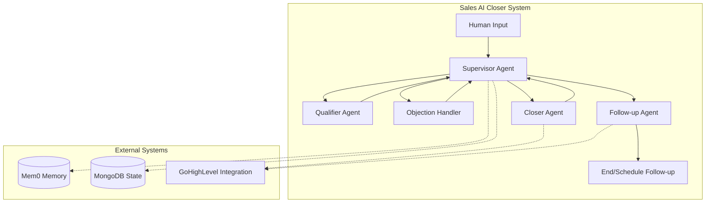
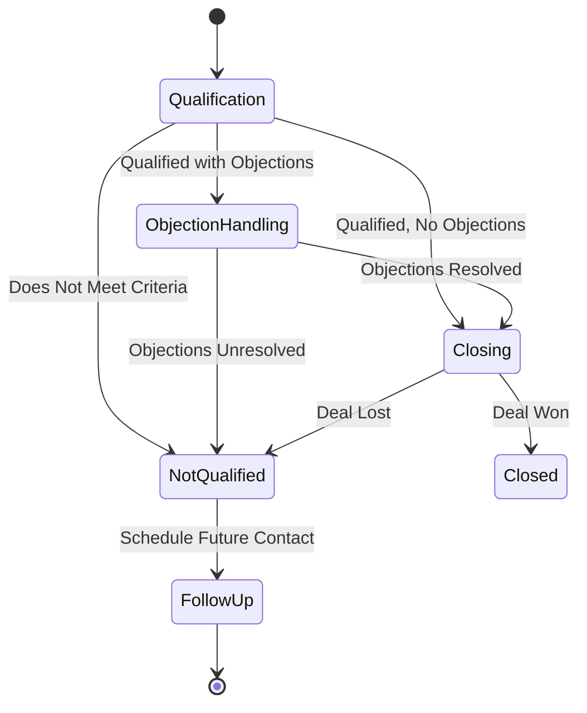
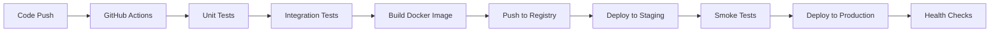

# Technical Design Document: Sales AI Closer Multi-Agent System

## Executive Summary

This document outlines the technical architecture and implementation strategy for the **Limitless OS Sales AI Closer** - a sophisticated multi-agent system built with LangGraph that automates the sales process through intelligent agent orchestration. The system employs a Supervisor Agent pattern to manage specialized sub-agents that handle different stages of the sales pipeline.

---

## Table of Contents

1. [System Overview](#system-overview)
2. [Architecture Design](#architecture-design)
3. [Core Components](#core-components)
4. [Data Flow & State Management](#data-flow--state-management)
5. [Technical Implementation](#technical-implementation)
6. [Integration Points](#integration-points)
7. [Deployment Strategy](#deployment-strategy)
8. [Security & Compliance](#security--compliance)
9. [Performance Considerations](#performance-considerations)
10. [Development Roadmap](#development-roadmap)

---

## 1. System Overview

### Purpose
The Sales AI Closer system automates the B2B sales process for Limitless OS services by intelligently qualifying leads, handling objections, and closing deals through AI-powered conversations.

### Key Business Objectives
- **Reduce Sales Cycle**: Automate initial qualification and follow-up
- **Increase Conversion Rates**: Use data-driven sales techniques
- **Scale Sales Operations**: Handle multiple prospects simultaneously
- **Improve Lead Quality**: Systematic qualification based on BANT criteria
- **24/7 Availability**: Engage prospects anytime, anywhere

### High-Level Architecture



---

## 2. Architecture Design

### Design Pattern: Supervisor Agent with Specialized Sub-Agents

The system implements a **hierarchical multi-agent pattern** where:
- A central Supervisor Agent orchestrates the workflow
- Specialized sub-agents handle specific sales tasks
- State flows through a directed graph managed by LangGraph
- All agents share a common state that persists across interactions

### Technology Stack

| Component | Technology | Purpose |
|-----------|------------|---------|
| Orchestration | LangGraph | State-based workflow management |
| LLM | OpenAI GPT-4 | Natural language processing |
| Memory | Mem0 | Conversational context storage |
| State Storage | MongoDB | Persistent state management |
| API Framework | FastAPI | REST API endpoints |
| CRM | GoHighLevel | Lead management & automation |
| Deployment | Docker/K8s | Container orchestration |

---

## 3. Core Components

### 3.1 Supervisor Agent

**Responsibilities:**
- Analyze incoming messages and current state
- Route to appropriate sub-agent
- Manage state transitions
- Track sales pipeline progress
- Handle error recovery

**Decision Logic:**
```python
# Pseudocode for routing logic
if not state.is_qualified:
    route_to = "qualifier"
elif state.is_qualified and has_objections(state):
    route_to = "objection_handler"
elif state.is_qualified and no_objections(state):
    route_to = "closer"
else:
    route_to = "follow_up"
```

### 3.2 Qualifier Agent

**Purpose:** Assess prospect fit based on BANT criteria

**Key Functions:**
- Extract budget information
- Identify business needs
- Determine decision-making authority
- Understand implementation timeline
- Store qualification data in memory

**Qualification Criteria:**
```yaml
Budget: 
  - Minimum: $1,000/month
  - Preferred: $5,000+/month
Need:
  - Business process automation
  - AI/ML implementation
  - Digital transformation
Authority:
  - Decision maker
  - Budget holder
  - Technical evaluator
Timeline:
  - Immediate: < 30 days
  - Short-term: 1-3 months
  - Long-term: 3-6 months
```

### 3.3 Objection Handler Agent

**Purpose:** Address concerns and overcome sales obstacles

**Common Objections Handled:**
- Price/Budget concerns
- Implementation complexity
- Security/Compliance requirements
- Integration challenges
- Change management resistance
- ROI justification

**Objection Handling Framework:**
1. Acknowledge and empathize
2. Clarify the root concern
3. Provide specific solutions/examples
4. Offer risk mitigation
5. Confirm resolution

### 3.4 Closer Agent

**Purpose:** Finalize deals and secure commitments

**Key Functions:**
- Present customized proposals
- Create urgency through limited offers
- Handle final negotiations
- Secure payment/contract agreements
- Update GoHighLevel opportunity stage

**Closing Techniques:**
- Assumptive close
- Urgency/Scarcity creation
- Risk reversal (guarantees)
- Social proof presentation
- Value stacking

### 3.5 Follow-up Agent

**Purpose:** Maintain engagement with non-qualified or undecided prospects

**Key Functions:**
- Schedule future touchpoints
- Create GoHighLevel follow-up sequences
- Nurture campaigns for different scenarios
- Re-engagement strategies

---

## 4. Data Flow & State Management

### 4.1 State Structure

```typescript
interface SalesState {
    // Conversation Data
    conversation_history: Message[]
    current_message: string
    
    // Sales Pipeline
    sales_stage: 'qualification' | 'objection_handling' | 'closing' | 'not_qualified'
    is_qualified: boolean | null
    qualification_details: {
        budget: string
        need: string
        authority: string
        timeline: string
    }
    
    // Objections & Concerns
    objections: string[]
    objection_resolutions: Record<string, string>
    
    // Memory & Context
    memories: MemoryEntry[]
    user_id: string
    session_id: string
    
    // Metadata
    interaction_count: number
    last_interaction: Date
    deal_value: number
    follow_up_scheduled: boolean
}
```

### 4.2 State Transitions



### 4.3 Memory Management Strategy

**Mem0 Integration:**
- Store conversation context
- Track customer preferences
- Remember pain points and goals
- Maintain objection history

**MongoDB Persistence:**
- Complete state snapshots
- Session management
- Analytics data
- Follow-up scheduling

---

## 5. Technical Implementation

### 5.1 LangGraph Workflow Definition

```python
# Simplified workflow structure
class SalesWorkflow:
    def __init__(self):
        self.workflow = StateGraph(SalesState)
        
        # Add nodes
        self.workflow.add_node("supervisor", supervisor_agent)
        self.workflow.add_node("qualifier", qualifier_agent)
        self.workflow.add_node("objection_handler", objection_handler_agent)
        self.workflow.add_node("closer", closer_agent)
        self.workflow.add_node("follow_up", follow_up_agent)
        
        # Define edges
        self.workflow.add_conditional_edges(
            "supervisor",
            route_supervisor,
            {
                "qualifier": "qualifier",
                "objection_handler": "objection_handler",
                "closer": "closer",
                "follow_up": "follow_up"
            }
        )
```

### 5.2 Agent Implementation Pattern

```python
# Standard agent structure
async def agent_template(state: SalesState) -> SalesState:
    # 1. Retrieve relevant memories
    memories = await mem0_client.search(
        query=state.current_message,
        user_id=state.user_id
    )
    
    # 2. Construct prompt with context
    prompt = build_agent_prompt(state, memories)
    
    # 3. Get LLM response
    response = await llm.generate(prompt)
    
    # 4. Update state
    state = update_state(state, response)
    
    # 5. Store new memories
    await mem0_client.add(response.memories, state.user_id)
    
    # 6. Update MongoDB
    await mongodb_client.update_state(state)
    
    return state
```

### 5.3 Tool Integration

**GoHighLevel Tools:**
```python
class GoHighLevelTools:
    async def create_contact(data: ContactData) -> str
    async def update_opportunity(id: str, stage: str) -> bool
    async def schedule_followup(contact_id: str, date: datetime) -> str
    async def add_to_campaign(contact_id: str, campaign_id: str) -> bool
    async def send_notification(message: str) -> bool
```

---

## 6. Integration Points

### 6.1 GoHighLevel Integration

**Purpose:** Synchronize sales activities with CRM

**Integration Features:**
- **Contact Management**: Create/update contacts in real-time
- **Opportunity Tracking**: Update deal stages automatically
- **Workflow Triggers**: Initiate GHL automations based on AI actions
- **Calendar Integration**: Schedule follow-ups and appointments
- **Campaign Assignment**: Add prospects to nurture sequences

**API Endpoints Used:**
```yaml
Contacts:
  - POST /contacts
  - PUT /contacts/{id}
  - GET /contacts/{id}

Opportunities:
  - POST /opportunities
  - PUT /opportunities/{id}
  - GET /opportunities/search

Calendars:
  - POST /calendars/events
  - GET /calendars/free-slots

Workflows:
  - POST /workflows/{id}/trigger
```

### 6.2 Communication Channels

**Supported Inbound Channels:**
- Instagram DM (via webhook)
- Facebook Messenger
- SMS (via GHL)
- Email (via GHL)
- Web Chat Widget

**Outbound Capabilities:**
- GHL SMS automation
- Email sequences
- Social media responses

---

## 7. Deployment Strategy

### 7.1 Infrastructure Requirements

```yaml
Production Environment:
  API Servers:
    - Type: FastAPI on K8s
    - Instances: 3 (auto-scaling)
    - CPU: 2 cores per instance
    - Memory: 4GB per instance
    
  Database:
    - MongoDB Atlas: M10 cluster
    - Storage: 100GB initial
    - Backup: Daily snapshots
    
  Message Queue:
    - Redis for async tasks
    - Pub/Sub for real-time events
```

### 7.2 Deployment Pipeline



---

## 8. Security & Compliance

### 8.1 Data Protection

- **Encryption**: TLS 1.3 for transit, AES-256 for storage
- **PII Handling**: Automatic redaction in logs
- **Access Control**: Role-based permissions (RBAC)
- **Audit Logging**: All state changes tracked

### 8.2 API Security

- **Authentication**: JWT tokens with refresh mechanism
- **Rate Limiting**: 100 requests/minute per user
- **Input Validation**: Pydantic schemas for all inputs
- **CORS Policy**: Restricted to authorized domains

### 8.3 Compliance Considerations

- **GDPR**: Data retention policies, right to deletion
- **CCPA**: California privacy compliance
- **SOC 2**: Security controls documentation
- **HIPAA**: If handling healthcare clients

---

## 9. Performance Considerations

### 9.1 Response Time Targets

| Operation | Target | Maximum |
|-----------|--------|---------|
| Initial Response | < 1s | 3s |
| Agent Handoff | < 500ms | 1s |
| Memory Retrieval | < 200ms | 500ms |
| State Update | < 100ms | 300ms |
| GHL API Call | < 1s | 3s |

### 9.2 Scaling Strategy

**Horizontal Scaling:**
- Stateless agent design
- Load balancing across instances
- Database connection pooling
- Caching layer (Redis)

**Optimization Techniques:**
- Batch memory operations
- Async processing for non-critical tasks
- LLM response streaming
- Efficient state serialization

---

## 10. Development Roadmap

### Phase 1: MVP (Weeks 1-4)
- [x] Basic Supervisor Agent
- [x] Qualifier Agent implementation
- [ ] MongoDB state management
- [ ] Basic GHL integration
- [ ] Simple chat interface

### Phase 2: Core Features (Weeks 5-8)
- [ ] Objection Handler Agent
- [ ] Closer Agent with deal tracking
- [ ] Complete Mem0 integration
- [ ] Advanced GHL workflows
- [ ] Multi-channel support

### Phase 3: Enhancement (Weeks 9-12)
- [ ] Follow-up Agent automation
- [ ] Analytics dashboard
- [ ] A/B testing framework
- [ ] Advanced closing strategies
- [ ] Performance optimization

### Phase 4: Scale & Polish (Weeks 13-16)
- [ ] Multi-tenant architecture
- [ ] White-label capabilities
- [ ] Advanced reporting
- [ ] ML model fine-tuning
- [ ] Enterprise features

---

## Appendices

### A. Example Conversation Flow

```
User: "I'm interested in automating our sales process"
→ Supervisor: Routes to Qualifier

Qualifier: "That's great! Can you tell me about your current sales volume and team size?"
User: "We have 5 sales reps handling about 200 leads/month"

Qualifier: "What's your budget for sales automation tools?"
User: "Around $3-5k per month"
→ Supervisor: Qualified=True, Routes to Objection Handler

User: "But I'm worried about implementation time"
Objection Handler: "I understand. Our typical implementation takes just 2 weeks with dedicated support..."
→ Supervisor: Objection resolved, Routes to Closer

Closer: "Based on your needs, I recommend our Professional plan at $3,500/month. This includes..."
User: "Sounds good, how do we get started?"
→ Creates GHL opportunity, schedules onboarding
```

### B. Error Handling Matrix

| Error Type | Handling Strategy | Fallback |
|------------|------------------|----------|
| LLM Timeout | Retry with exponential backoff | Generic response |
| Memory Failure | Continue without context | Log for manual review |
| GHL API Error | Queue for retry | Email notification |
| State Corruption | Restore from backup | Start new session |

### C. Monitoring & Metrics

**Key Performance Indicators:**
- Qualification rate
- Objection resolution rate
- Close rate by agent
- Average conversation length
- Response time per stage
- Memory retrieval accuracy

**Alerting Thresholds:**
- Response time > 5s
- Error rate > 5%
- Memory miss rate > 20%
- GHL sync failures > 10/hour

---

This technical design document serves as the blueprint for implementing the Sales AI Closer system. Regular updates will be made as the system evolves and new requirements emerge.